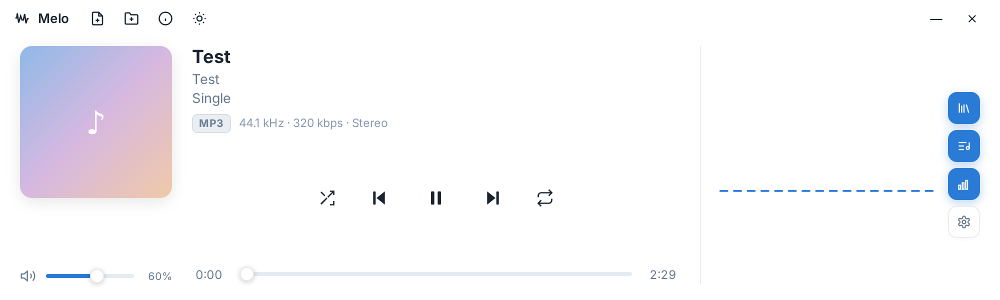

# Melo — Modern Windows Music Player

A lightweight, native-feeling desktop music player built with **Tauri 2**, **TypeScript** and **Rust**.
The main window is a compact player card; the Library, Playlist, Equalizer, Synced Lyrics and Settings each open as
**independent native OS windows** that stay in sync with the player.

Version: **0.5.2 Beta** • License: **GPL-3.0**



## ✨ Features

| Area | Details |
|------|---------|
| **Formats** | MP3, FLAC, WAV, AAC, OGG, ALAC/OPUS — metadata & covers read natively via Rust (`lofty`) |
| **Playback** | Play/Pause, Stop, Next/Prev, seek bar, volume under the cover, Shuffle, Repeat (Off/All/One). Keys: Space, ←/→, M, S, R, ↑/↓ |
| **Playlist Management** | Multiple playlists, **Drag & Drop reordering**, in-playlist **search/filter**, **sorting** (by Title, Artist, Album, Duration), M3U export |
| **Synced Lyrics** | Real-time synchronized lyrics support (**`.lrc` files** and embedded tags), smooth active line highlighting, auto-scroll, and click-to-seek |
| **Dynamic Ambient Theme** | Automatically extracts vibrant dominant colors from album artwork to dynamically colorize the accent, visualizer, and ambient glows (toggleable in Settings) |
| **System Tray Menu** | Windows system tray icon with full playback menu: Play/Pause, Next, Prev, Mute/Unmute, Show/Hide, and Quit |
| **Single-Instance** | Prevents multiple instances; clicking shortcuts or opening audio files from Explorer focuses the existing instance and plays immediately |
| **Multi-window** | Library / Playlist / Equalizer / Lyrics / Settings open as real OS windows, synced via the event bus |
| **Equalizer** | 10 bands (31 Hz – 16 kHz), 12 presets + Reset button, persistent state across restarts |
| **Skins from Disk** | Loads skins directly from the `skins/` installation folder; instant live reload via Refresh button (🔄) and explorer opener. Build your own player layout — any size, any structure — see the **[Skin Authoring Guide](skins/README.md)** |

## 🖥️ Build for Windows (GitHub Actions)

1. Create a GitHub repository and push this folder:
   ```bash
   git init
   git add .
   git commit -m "Melo 0.5.2 Beta"
   git branch -M main
   git remote add origin https://github.com/Arvanta/Melo.git
   git push -u origin main
   ```
2. The `Build Melo` workflow runs automatically on push (or via **Actions → Run workflow**).
3. Get the installers:
   - **Releases** → draft release `Melo v0.5.2 Beta` (contains `Melo_0.5.2_x64-setup.exe` and the `.msi`) — publish to keep it permanent.
   - **Actions → run → Artifacts → melo-windows** (zip with the same installers).
4. Install `Melo_0.5.2_x64-setup.exe` (installs to standard `C:\Program Files\Melo`).

## 🌐 Web Demo / Local Development

```bash
npm install
npm run dev      # http://localhost:1420
```

## 🛠️ Tech Notes

- **Rust**: `lofty` for metadata, `walkdir` + bounded background workers for scanning, SQLite for the Library, disk-cached artwork, and `tauri-plugin-single-instance` for single-instance control and tray actions.
- **Frontend audio**: `HTMLAudioElement` + one shared `AudioContext` (EQ filters → gain → analyser → output).
- **Desktop metadata**: `music-metadata-browser` is stubbed out of desktop bundles, keeping the Windows build small and fast.
